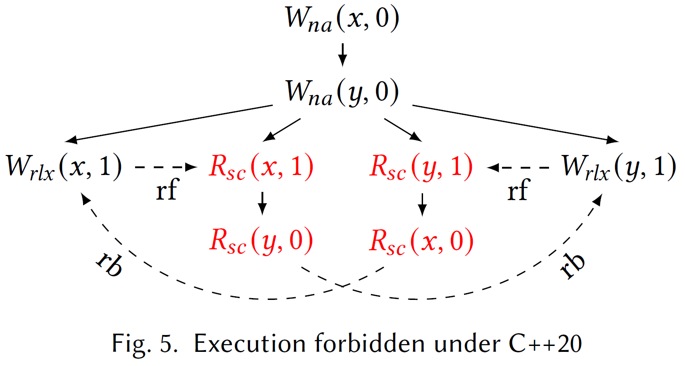

<!-- _class: title-academic -->
<div class="title">논문읽기 - Miri by Ralf Jung</div>
<div class="subtitle">Miri: Practical Undefined Behavior Detection for Rust</div>
<div class="author">Seoho Kim</div>
<div class="date">2025. 12. 29</div>
<div class="organization">PLRG</div>

---

<!-- _class: toc -->

0. Abstract
1. Introduction
2. Showcasing Miri
3. Miri Architecture Overview
4. Finding Concurrency Bugs: Data Race Detection and Weak Memory Exploration
5. Making Miri a Practical Tool
6. Evaluation
7. Related Work
8. Conclusion and Future Work

---

<!-- _class: chapter -->

# Abstract

## 논문의 주제의식

---

# Ch0. Rust 언어의 두가지 특징

- 타입 시스템을 통해 메모리 및 스레드 안전성을 보장하는 고수준 언어
- 하지만 Rust는 저수준 코딩이 필수불가결함

- ## Undefined Behavior; UB: 정의되지 않은 동작

  - 프로그램에서 발생하면 문제가 되는 것; 논문의 문제의식

---

# Ch0. MIRI: MIR Interpreter

Rust 프로그램에서 UB를 찾을 수 있는 도구

- Pointer Provenance 추적: 포인터의 출처를 정확히 추적
- Rust 타입 불변성 검증: 타입 규칙 위반 감지
- Data-race 탐지: 멀티스레드 환경에서의 동시성 버그 감지
- 약한 메모리 동작 탐색: 메모리 모델의 약한 보장 사항 검증
- OS API 구현: 파일 시스템, 동시성 프리미티브 등 기본 API 지원으로 실제 코드 실행 가능

## Miri의 성과

10만개 이상의 Rust 라이브러리를 대상으로 한 테스트에서 70%정도의 성공률을 보임

---

<!-- _class: chapter -->

# Introduction

## 논문이 해결하고자 하는 바

---

# Ch1. Rust

- 강력한 타입 시스템을 가진 언어
- 그 타입조차 충분하지 않다면 `unsafe` 키워드를 사용하여 코드 작성 가능

## 컴파일러는

- 프로그래머가 올바른 코드를 짰을 것으로 예상
- 논리적 흐름으로 올바름을 보장할 수 없다면, UB 발생 가능

---

# Ch1. Rust - `unsafe`

```rust
// safe, but slow
for i in 0..1_000_000 {
    let x = arr[i]; // check boundary condition every time
    // complex calculation
}

// unsafe, but fast
for i in 0..arr.len() { // promiss that i must in the range of arr
    unsafe {
        let x = get_unchecked(i); // pass boundary-condition-checking
        // complex calculation
    }
}
```

간단한 경우엔 문제가 발생하지 않을 수 있음

---

# Ch1. Rust - `unsafe` - Example 1

```rust
let x: i8 = unsafe { MaybeUninit::uninit().assume_init() };
assert!(x < 0 || x == 0 || x > 0);
println!("x = {x}");
```

1. `MaybeUninit::uninit()` $\to$ 초기화되지 않은 메모리 생성
2. `.assume_init()` $\to$ 초기화 되었다 가정, 문제 발생
3. 올바르게 초기화 되었다면 `x < 0 || x == 0 || x > 0` 은 tautology임
4. 컴파일러는 해당 assertion을 건너뜀 (수학적으로 참이기 때문 + CPU 절약을 위해)
5. 실제 출력시에 문제 발생

---

# Ch1. Rust - `unsafe` - Example 1

```rust
let x: i8 = unsafe { MaybeUninit::uninit().assume_init() };
assert!(x < 0 || x == 0 || x > 0);
println!("x = {x}");
```

- 위 예시가 UB의 예시
  - `.assume_init()` 연산이 `assert!()`의 전제조건을 위반하도록 만들었기 때문
  - Notoriously Unstable

> 그런데 실제 실행 결과에선 `x = 0`이 출력되었음
>
> - 다른 Example은 모두 논문과 같은 결과 출력됨

---

# Ch1. 보안 문제

## 보안 문제의 70%는 메모리 문제: UB

**공격자의 익스플로잇 흐름:**

- 버퍼 오버플로우 → vtable 덮어쓰기 → 함수 포인터 조작 → 임의 코드 실행

**UB의 진실:**

- 스펙상으로는 "정의되지 않음"
- 어떤 일이 발생해도 프로그램의 문제가 아님
- 메모리 안전 취약점 **70%** = **UB 사례**

---

# Ch1. 해결 방법

1. 형식 검증

- 정확도 완벽
- 모든 경로 분석 = 판정 불가능 $\to$ 실사용 불가능

2. Sanitizer (Instrumentation tool)

- 속도 빠름
- 정확도 낮음: provenance 미추적, 일부 UB 누락

3. **Miri**

---

# Ch1. Miri: 결정론적 프로그램에서 완전한 UB 감지

1. Abstract Machine 직접 구현
2. 포인터 provenance 추적
3. 실제 Rust 라이브러리 70% 테스트 성공

```bash
rustup +nightly component add miri

cargo +nightly miri run
```

---

<!-- _class: chapter -->

# Showcasing Miri

## Miri의 주요 기능

---

# Ch2. Unintialized Memory 감지

```rust
let x: i8 = unsafe { MaybeUninit::uninit().assume_init() };
```

- Rust: 초기화되지 않은 메모리 $\to$ 추상적 $\to$ 일반 정수처럼 해석 불가

  - 실제 CPU 구조와 다르게 취급함

- Miri가 이걸 해석할 수 있는 이유는?

---

# Ch2. Miri는 인터프리터

- 일반적으로, Rust 코드 > 컴파일 > 기계어 > CPU 실행, 컴파일 과정에서 정보 유실

> MIRI: cargo에서 front-end, middle-end 까지만 사용하여 mir을 만든 뒤에 해석

- Miri: MIR Interpreter
  - Rust 코드 > 컴파일 > MIR > Miri가 MIR 해석 > 정보 추적
- MIR: Middle Intermediate Representation
  - Rust 컴파일러의 중간 표현 (기계어보다 고수준)
  - 문장, 블록 단위로 해석 가능
  - 각 단계에서 메모리 상태 추적 가능
- 메모리 초기화, pointer provenance 등 일반 CPU에선 불가능한 정보도 추적 가능

---

# Ch2. Temporal and spatial memory safety violations

out-of-bound / use-after-free 탐지

```rust
let mut b = Box::new(0); // Allocate some memory on the heap.
let ptr = &raw mut *b; // Create a "raw" pointer to that memory.
drop(b); // Free the heap allocation.
unsafe { *ptr = 1 }; // Write to the freed memory.
```

- Miri는 모든 메모리 접근마다 포인터가 유효한지 확인

  - 메모리 접근 시마다 포인터 유효성 확인 / out-of-bound 검사
  - 메모리 할당/해제 기록 / use-after-free 검사
  - GC 적용

---

# Ch2. Memory leaks 검사

Miri가 잡을 수 있는 버그는 맞지만 UB는 아님

```rust
let b = Box::new(42);
std::mem::forget(b);
```

---

# Ch2. Data Race 감지

동기화 없이 같은 메모리에 여러 Thread가 접근할 수 있는 가능성을 감지

```rust
static mut GLOBAL: i32 = 0;
thread::spawn(|| unsafe { GLOBAL = 1 });
thread::spawn(|| println!("GLOBAL={}", unsafe { GLOBAL }));
```

- Miri는 vector clock 기반 data race detector를 내장함
- 동시 접근은 모두 '읽기'일 때만 허용함
- Data Race는 비결정적이라 못찾을 수도 있음
  - Miri는 랜덤 seed로 순서를 바꿔가며 실행, 약 90% 정도 찾을 수 있음

```bash
cargo +nightly miri run --many-seeds
```

---

# Ch2. Weak memory behaviors

weak memory model (CPU 메모리 최적화)로 인한 버그는 못 찾음: 동적분석기의 한계

```rust
static X: AtomicI32 = AtomicI32::new(0);
static Y: AtomicI32 = AtomicI32::new(0);
thread::scope(|s| {
    s.spawn(|| {  // Thread 1
        X.store(1, Ordering::Relaxed);
        Y.store(1, Ordering::Relaxed);
    });
    s.spawn(|| {  // Thread 2
        if Y.load(Ordering::Relaxed) == 1 {
            assert!(X.load(Ordering::Relaxed) == 1);
        }
    });
});
```

---

# Ch2. Weak memory behaviors

```rust
static X: AtomicI32 = AtomicI32::new(0);
static Y: AtomicI32 = AtomicI32::new(0);
```

Atomic: 원자적; 더이상 나눌 수 없음, data race 발생 안함

```rust
X.store(1, Ordering::Relaxed);
Y.store(1, Ordering::Relaxed);
```

Relaxed: 연산 순서 보장 안함 (CPU가 재배치 가능)

- Y를 먼저 쓸 수 있음 $\to$ assertion
- 많은 시드를 돌려야 찾을 수 있는 버그; Miri는 25% 정도의 확률로 탐지

```bash
cargo +nightly miri run --many-seeds
```

---

# Ch2. Rust Type Invariants

```rust
struct S { _f1: bool, _f2: i16 }
let _s: S = unsafe { mem::transmute(u32::MAX) };
```

- `u32::MAX == 0xFFFFFFFF`
- `0xFF` : `bool` $\to$ UB
  - only `0x00 (false)` or `0x01 (true)` $\to$ `0xFF`는 UB
- `0xFFFF` : `i16` $\to$ OK
- `0xFF` : padding

---

# Ch2. Pointer provenance (포인터 출처)

```rust
let mut x = 0u8;
let xptr = &raw mut x;
let mut y = 1u8;
let yptr = &raw mut y;
// Make a second pointer to x
let x_minus_y = (xptr as usize).wrapping_sub(yptr as usize);
let xptr2 = yptr.wrapping_add(x_minus_y); // y + (x-y)
// Use both pointers
unsafe {
    xptr2.write(2);
    assert!(xptr.read() == 2);
}
```

값은 동일해 보이지만, 두 포인터의 출처가 다름 (`x` vs `y`)

---

# Ch2. Pointer provenance (포인터 출처)

- 위의 경우, `wrapping_add` 함수의 docs를 읽어보면

  - 결과 포인터는 self가 가리키는 할당을 '기억'한다.
  - 다른 할당을 읽거나 쓰는 데 사용되어서는 안 된다.

- 즉, y에 대한 권한을 가진 포인터를 이용해서 x의 값을 변경하려고 하니까 UB

- Miri는 각 pointer의 provenance를 기억함

---

# Ch2. Aliasing violations

- Rust의 참조 타입의 별칭 요구사항을 위반
- 선행 논문에서 다룸

---

<!-- _class: chapter -->

# Miri Architecture Overview

## Miri가 프로그램 실행 중 추적하는 상태

---

# Ch3.

- 너무 복잡한 구조적 내용 & 논문 주제에서 중요하지 않은 내용은 생략함
- 실제 Miri는 컴파일러와 이미 통합되어 있는 부분도 있는데, 이 부분도 간략하게 표현
- Rust에서 메모리는 단순 바이트 배열 X $\to$ 포인터가 기리킬 수 있는 모든 것 (함수 등)

  - 실제 프로그램의 실행 상태를 추적하기 위해 많은 정보를 저장함
  - 예시로 Rust의 dyn Trait 타입의 내부 구현 세부사항 vtable이 있음
    Miri가 vtable을 완벽하게 지원하지만 논문에선 생략함

---

# Ch3. Values and Operands

$$
\begin{align}
Provenance &\triangleq \operatorname{Known}(AllocId) ~\vert~ \operatorname{Wildcard} \\
Pointer &\triangleq \{\operatorname{addr}: \mathbb{N}, \operatorname{prov}: Provenance\} \\
Scalar & \triangleq \operatorname{Int}(\mathbb{Z}) ~\vert~ \operatorname{Ptr}(Pointer) \\
Operand & \triangleq \operatorname{Scalar}(Type \times Scalar) ~\vert~ \operatorname{NonScalar}(Type \times \operatorname{List}(Byte))
\end{align}
$$

---

# Ch3. Values and Operands

- 피연산자(Operand): 스스로의 type을 가지고 다님
  - 수학적 표현을 가진 Scalar,
    - 정수 Int
    - 포인터 Pointer
      - 주소값 addr
      - 출처 prov
        - allocation의 고유 id
        - wildcard
  - 혹은 Byte의 나열 NonScalar

---

# Ch3. Memory

$$
\begin{align}
AllocId & \triangleq \mathbb{N}  \\
Byte &\triangleq \operatorname{Uninit} ~\vert~ \operatorname{Init}(\operatorname{val}: \mathbb{N}_{<256}, \operatorname{prov}: Provenance_{\bot}) \\
DataAlloc &\triangleq \{\operatorname{data}: \operatorname{List}(Byte \times DataRaceLoc), \operatorname{mutable}: \mathbb{B}, \operatorname{align}: \mathbb{N}\} \\
Alloc &\triangleq \operatorname{DataAlloc}(DataAlloc) ~\vert~ \operatorname{FnAlloc}(Instance)\\
Memory &\triangleq \{\operatorname{allocs} : AllocId \xrightharpoonup{\text{fin}} \mathbb{N} \times Alloc, \operatorname{exposed}: \mathcal{P}(AllocId)\}
\end{align}
$$

---

# Ch3. Memory

- Memory
  - allocs: allocId $\to$ (절대주소, alloc 정보)
    - alloc: 실행중 데이터 저장 or 코드 저장 (~closure)
      - 포함된 바이트 목록
        - 초기화가 안되었거나
        - 초깃값 + 출처 (provenance)
      - 수정 가능 여부
      - align: alloc의 시작 주소가 n의 배수 (~ sizeof type)
  - **exposed**

---

# Ch3. Memory

$$
\begin{align}
0 &\mapsto (16, \operatorname{DataAlloc}(\{\operatorname{data}: [\operatorname{Init}(0, \bot), \operatorname{Init}(0, \bot), \operatorname{Uninit}, \operatorname{Uninit}]\})) \\
1 &\mapsto (32, \operatorname{DataAlloc}(\{\operatorname{data}: [\operatorname{Init}(16, \operatorname{Known}(0)), \operatorname{Init}(0, \operatorname{Known}(0)),\cdots, \operatorname{Init}(0, \operatorname{Known}(0))]\}))
\end{align}
$$

- 포인터는 8byte
  - 모든 바이트에 동일하게 Known(0) provenance 부여
  - 포인터가 아니면 $\bot$ (출처 없음)
- `Memory.allocs`
  - Alloc 안의 DataAlloc 중 mutable, align은 생략,
  - data의 DataRaceLoc도 생략

---

# Ch3. Exposed provenance and integer-pointer casts.

`memory.exposed` 필드는? 포인터가 정수로 노출된 할당들의 집합

- 포인터 $\to$ 정수 캐스팅: 할당을 exposed에 추가
  - 외부로 노출됨
- 정수 $\to$ 포인터 캐스팅: Wildcard provenance 부여
  - 출처를 알 수 없으므로
- Wildcard 포인터 메모리 접근: exposed 할당만 허용

---

# Ch3. Exposed provenance and integer-pointer casts.

PNVI

- Provenance-Not-Via-Integers: 정수 $\to$ provenance 불가능 $\to$ **너무 엄격**

PNVI-ae

- PNVI Address-Exposed: 노출된 주소만 복원

PNVI-wildcard

- 모든 정수 $\to$ 포인터 변환에 wildcard $\to$ **너무 관대함**

**Miri** $\to$ ae + wildcard

---

# Ch3. Stack and Thread

$$
\begin{aligned}
\mathit{Thread}
  &\triangleq
    \begin{aligned}[t]
      \{\,&\mathit{state} : \mathit{ThreadState},\mathit{stack} : \mathit{List}(\mathit{Frame}),\\
      &\mathit{unwind\_payloads} : \mathit{List}(\mathit{Scalar}),\mathit{data\_race} : \mathit{DataRaceThread}\,\}
    \end{aligned}
  \\
\mathit{ThreadState}
  &\triangleq
    \mathit{Enabled}
    \mid \mathit{Blocked}
    \mid \mathit{Terminated}
  \\
\mathit{ReturnCont}
  &\triangleq
    \mathit{Stop}
    \mid \mathit{Goto}(
        \mathit{ret} : \mathit{MirBlockId},
        \mathit{unwind} : \mathit{UnwindAct})
  \\
\mathit{Frame}
  &\triangleq
    \begin{aligned}[t]
      \{\,&\mathit{body} : \mathit{MirBody}, \mathit{locals} : \mathit{MirLocal} \xrightharpoonup{\text{fin}} \mathit{Pointer},\\
      &\mathit{loc} : \mathit{MirBlockId} \times \mathbb{N}, \mathit{return\_place} : \mathit{Pointer},\\
      &\mathit{return\_cont} : \mathit{ReturnCont}, \mathit{catch\_unwind} : \mathit{CatchUnwind}_\bot\,\}
    \end{aligned}
  \\
\mathit{UnwindAct}
  &\triangleq
    \mathit{Cleanup}(\mathit{MirBlockId})
    \mid \mathit{Continue}
    \mid \mathit{Unreachable}
    \mid \mathit{Terminate}
\end{aligned}
$$

---

# Ch3. Stack and Thread

<div class="multicolumn" align="center">
<div>
Thread (스레드별 상태)

- state: Enabled | Blocked | Terminated

- stack: 호출 스택 (Frame 목록)

- unwind_payloads: 패닉 전달값

- data_race: 데이터 레이스 추적
</div><div>
Frame (스택 프레임)

- body: MIR 함수 본문

- locals: 지역변수 → 메모리 포인터 맵

- loc: 다음 실행 위치 (BlockId, 문장 인덱스)

- return_place: 반환값 저장 위치

- return_cont: 호출자 복귀 위치
</div></div>

각 process를 정확히 추적하기 위한 구조

---

# Ch3. Unwinding

Rust에서 함수를 종료하는 방법: Return or Panic

- 패닉 발생 $\to$ 스택 언와인딩 $\to$ 각 프레임 소멸자 실행 $\to$ catch_unwind에서 멈춤

- return_cont: 정상 반환(Goto) + 언와인딩(UnwindAct)
- UnwindAct:
  - Cleanup(block): 소멸자 MIR 실행
  - Continue: 소멸자 없음 $\to$ 바로 caller로
  - Unreachable: 언와인딩 = UB
  - Terminate: 즉시 종료

---

# Ch3. Concurrency

Miri: 순차 인터프리터지만 "멀티스레드 프로그램" 해석 가능

- 실제로는 병렬 실행을 하지만
- Miri는 randome scheduling을 통해 여러 쓰레드를 오감
  - 결정론적 재현으로 동시성 버그 검출 위함

---

<!-- _class: chapter -->

# Soundness, Completeness, and de-facto Undefined Behavior

## 안전성과 완전성

---

# Ch4.

Data Race 와 Weak Memory 는 앞 챕터에서 해결 못함

선행 논문의 Data Race Detector (FastTrack)를 그대로 사용하고자 했으나 부적합

- 메모리 주소는 atomic / non-atomic 중 하나라고 가정, Rust에서는 둘이 섞일 수 있음
- C++11 $\to$ C++20으로 C의 버젼이 바뀌면서 새로운 UB가 생김

---

# Ch4.

$$
\begin{aligned}
\mathit{VTimestamp} &\triangleq \mathbb{N} \times \mathit{Span} \\
\mathit{VClock} &\triangleq \mathit{TID} \xrightharpoonup{\mathrm{fin}} \mathit{VTimestamp} \\
\mathit{DataRaceLoc} &\triangleq
  \begin{aligned}[t]
    \{\,&\mathit{read} : \mathit{VClock},\\
    &\mathit{write} : \mathit{TID} \times \mathit{VTimestamp},\\
    &\mathit{atomic} : \mathit{DataRaceALoc}_\bot\,\}
  \end{aligned}
\\
\mathit{DataRaceThread} &\triangleq
  \begin{aligned}[t]
    \{\,&\mathit{clock} : \mathit{VClock},\\
    &\mathit{fence\_acquire} : \mathit{VClock},\\
    &\mathit{fence\_release} : \mathit{VClock},\\
    &\mathit{write\_sc} : \mathit{VClock},\\
    &\mathit{read\_sc} : \mathit{VClock}\,\}
  \end{aligned}
\end{aligned}
\begin{aligned}
\mathit{DataRaceGlobal} &\triangleq
  \begin{aligned}[t]
    \{\,&\mathit{last\_sc\_fence} : \mathit{VClock},\\
    &\mathit{last\_sc\_write} : \mathit{VClock}\,\}
  \end{aligned}
\\
\mathit{DataRaceALoc} &\triangleq
  \begin{aligned}[t]
    \{\,&\mathit{atomic\_read} : \mathit{VClock},\\
    &\mathit{atomic\_write} : \mathit{VClock},\\
    &\mathit{sync} : \mathit{VClock},\\
    &\mathit{size} : \mathbb{N}_\bot,\\
    &\mathit{store\_buffer} : \mathit{List}(\mathit{StoreElem})\,\}
  \end{aligned}
\\
\mathit{StoreElem} &\triangleq
  \begin{aligned}[t]
    \{\,&\mathit{store} : \mathit{TID} \times \mathit{VTimestamp},\\
    &\mathit{sync} : \mathit{VClock},\\
    &\mathit{is\_sc} : \mathbb{B},\\
    &\mathit{load\_ts} : \mathit{TID} \xrightharpoonup{\mathrm{fin}} \mathit{VTimestamp},\\
    &\mathit{sc\_loaded} : \mathbb{B},\\
    &\mathit{val} : \mathit{Scalar}\,\}
  \end{aligned}
\end{aligned}
$$

---

# Ch4. Integrating Dynamic Data Race Detection into Miri

DataRaceLoc (바이트별) $\to$ DataRaceThread (스레드별) $\to$ DataRaceGlobal (전역) 확인

## Vector Clock

Thread Id $\to$ (time, span)

- weak memory: 전역 시간 비교 불가능 $\to$ partial order 필요
- span: 사용자 친화적 오류 메시지

---

# Ch4. Integrating Dynamic Data Race Detection into Miri

## Read

1. 마지막 쓰기 스레드 확인
2. 그 쓰기가 "내 과거"에 있는가? $\to$ NO? Race
3. 읽기 클록 갱신

## Write

1. 마지막 쓰기 "내 과거"에 있는가? (write-write) $\to$ NO? Race
2. 모든 읽기 클록 "내 과거"에 있는가? (write-read) $\to$ NO? Race
3. 쓰기 클록 갱신 + 읽기 클록 리셋

---

# Ch4. Integrating Dynamic Data Race Detection into Miri

## 동기화

`A.unlock()`: 락에 현재 clock 저장
`B.lock()`: 저장된 clock을 자신의 clock과 병합 (pointwise max)

$\to$ A의 모든 과거 이벤트가 B의 과거가 됨 (happens-before)

---

# Ch4. Mixed Atomic and Non-Atomic Accesses

DataRaceALoc: {... size} $\to$ 해당 위치에 원자적 접근을 한 크기를 저장

1. 처음: 모든 위치 $\to$ 비원자적
2. atomic read/write $\to$ 원자적 (DataRaceALoc 초기화)
3. non-atomic write $\to$ 다시 비원자적
4. non-atomic read $\to$ 영향 없음 (Rust: 읽기는 자유롭게 허용)

---

# Ch4. Mixed Atomic and Non-Atomic Accesses

1. 첫 atomic write $\to$ size 설정
2. 동기화 후 $\to$ size 변경 OK (atomic write)
3. 비동기 다른 크기:

- Read: size=$\bot$ (이후 read만 허용)
- Write: UB

---

# Ch4. C++20 Weak Memory Exploration

CPU의 쓰기와 읽기 사이에 지연 발생

**Miri**: Store Buffer 사용

- Atomic Write: store_buffer에 "쓰기 대기열" 추가
  - CPU1 Write(42) $\to$ buffer.push(42)
- Atomic Read: 대기열 뒤에서 "보이는 값" 선택
  - CPU2 Read() $\to$ buffer.pop() $\to$ 42

---

# Ch4. coherence-ordered-before

$$
\begin{matrix}
x:=_{na}0; y:=_{na}0 \\
\left.
x:=_{rlx}1
~\middle\Vert~
\begin{aligned}[t]
&\operatorname{spin until} 1=x_{sc} \\
& c := y_{sc}
\end{aligned}
~\middle\Vert~
\begin{aligned}[t]
&\operatorname{spin until} 1=y_{sc} \\
& d := x_{sc}
\end{aligned}
~\middle\Vert~
y :=_{rlx}1
\right.
\end{matrix}
$$

- 일반적인 경우에 c = 1 = 1 / c = 1, d = 0 / c = 0, d = 1이 가능

---

# Ch4. coherence-ordered-before



- C++11에선 순환 가능 $\to$ c = d = 0의 결과도 가능
- C++20에서 해결: SC 읽기가 본 값 $\to$ 그 쓰기는 이미 완료 $\to$ 순환 불가능
- Miri에 `sc_loaded` 플래그 추가

---

# Ch4. SC Fence

C++11 SC fence $\to$ 약한 보장
C++20 SC fence $\to$ `fence(Acq); rmw(f, AcqRel); fence(Rel)` (f: 고유 전역 위치)

**Miri**: Syntactic Sugar

- 특별 필드($\$_F$) 불필요, 기존 acquire/release 메커니즘으로 대체

```rust
SC_fence() =
  fence(acquire) +
  rmw(ghost_loc, acqrel) +
  fence(release)
```

---

# Ch4. Release sequences

C++11: release sequence 시작 스레드의 relaxed store $\to$ 시퀀스 유지
C++20: relaxed store $\to$ 시퀀스 끊김 (모든 relaxed store 동일 처리)

- Vector Clock에서 원논문의 $\mathbb{V}$가 필요 없어짐
- 코드 단순화 + 메모리 절약

---

# Ch4. Limitations

Miri가 모든 weak behavior을 탐색하진 못하지만, 발견한 버그는 모두 진짜 버그임

- **No False Positive**

### Out-of-Thin-Air (OOTA) 문제

- 미래 정보의 순환은 차단 $\to$ 일부 정상 동작 탐지 못함

### 전역 순서 한계

- 모든 연산을 단일 순서로 진행 (병렬 X)
  - 2+2W Lismus Test $\to$ 놓침

## 하지만 거짓 양성이 없으므로 실무에 적합
